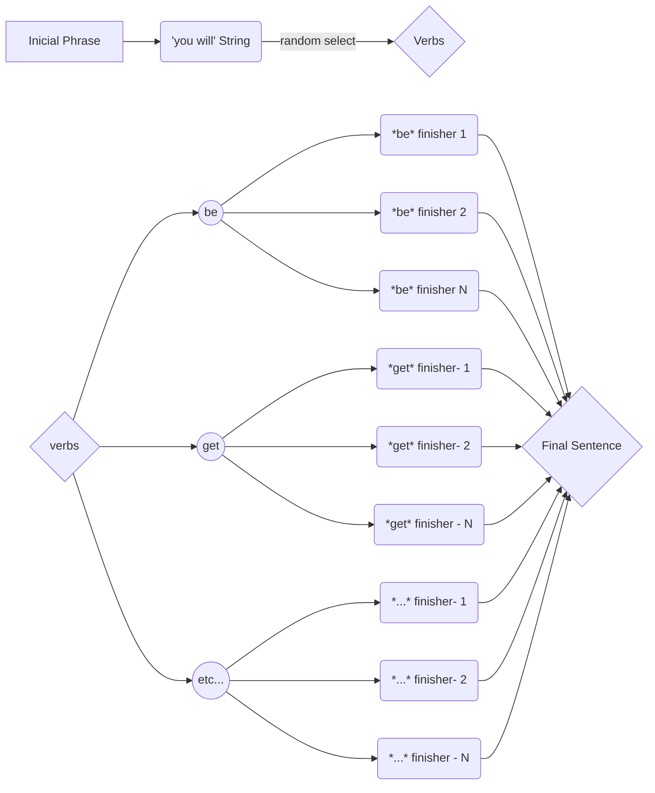

# Mixed Message Project

This is a project to test my abilities in JavaScript.

  

## What it is?

  

The goal of this project is to create a **random** message generator that generates a new message every time the action button is activated.

  

## Concept:

The program will create messages for a **Psychic** to read the future of user.

>Messeges will have three components:

- A starter line, saying that she is seeing in the future that something will happen.

- A verb

- An action based on which kind of verb was randomly selected

  

## Sentence Flow Chart

>The elements that will compose the sentence are:

- An initial phrase `12 possibilities`
- 'You will' String `1 possibility`
- A verb `7 possibilities`
- A **Finisher** sentence `Around 15 possibilities for each verb`

>This is path these elements go through to be randomly generate a **final sentence**:

  
  

### Tecnologies and concetps used:

  

#### **JavaScript:**

This language will be used for the back-end design of the project.

>*Main concepts used:*

1. Arrays and their functions.

2. Functions.

3. Math object.

4. Conditionals.

5. Switch statements.

6. DOM events

  

#### **HTML and CSS:**

  

Used to construct a simple interface so the user can press the action button and get the results.

>*Main concepts used:*

1. Semantic elements

2. Responsive Design

  

#### **AI Drawing Designs**

The witch drawing was created by an AI (not mine), from the website [tinywow](https://tinywow.com/image/ai-art-generator)

  
  

#### **Markdown:**

- To write README file

  

#### Here is the deployed finished program, hope you like it!: [Crazy Fortune Teller](https://ribeiroallison.github.io/mixed-messages/)

  
  
  

###### ~~*Wish me a luck (or a miracle)!*~~ Yay, I did it!